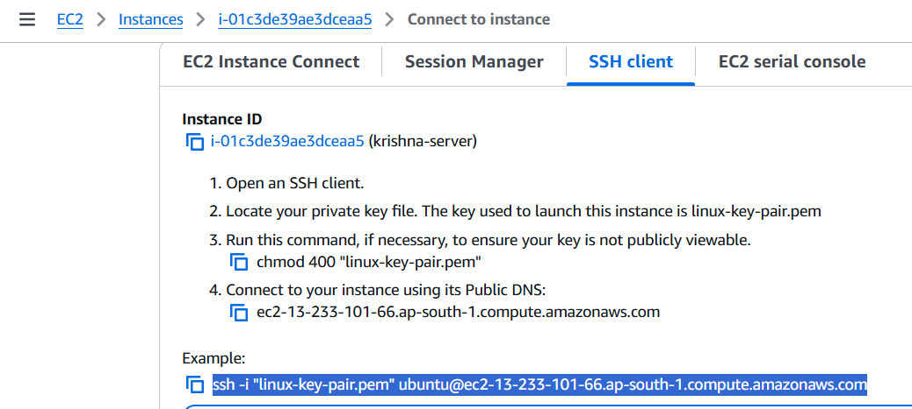
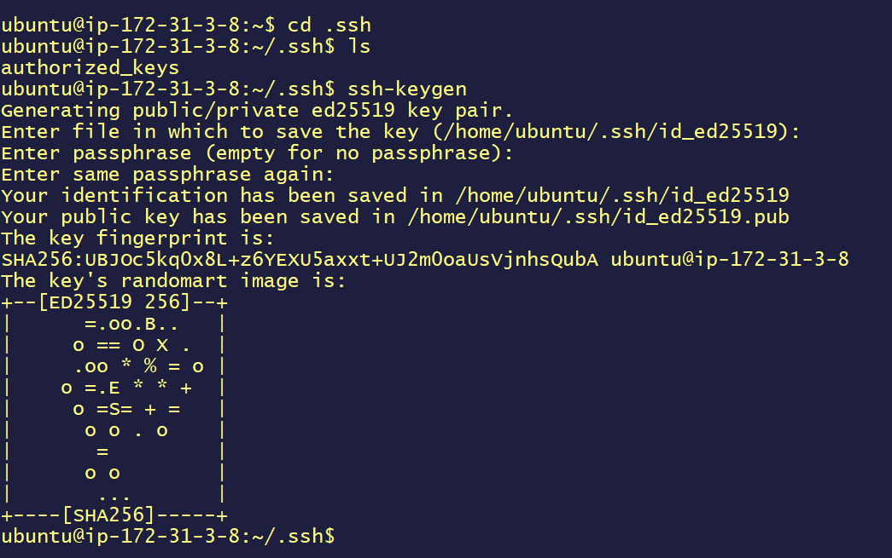

# 🐧 **Linux Advanced Guide**

Welcome to the **Linux Advanced Guide**! 🚀 This guide will take you through a variety of advanced Linux topics to enhance your **system administration** and **troubleshooting** skills. Whether you're a beginner or an experienced admin, this guide has something for you. Let's dive in! 🖥️

---

## 📚 **Table of Contents**

- [👤 User Management](#user-management)
- [🔐 File Permissions](#file-permissions)
- [🔒 SSH, SCP, Update, Upgrade, Purge, Systemctl](#ssh-scp-update-upgrade-purge-systemctl)
- [⚙️ Useful Commands: `grep`, `awk`, `sed`, `find`](#useful-commands-grep-awk-sed-find)
- [💾 Volume Mount](#volume-mount)
- [📜 Logs](#logs)

---

## 👤 **User Management**

Managing users in Linux is essential for controlling access to system resources. Here's how you can manage users and groups effectively.

### 🔍 **Check the current login user**:
```bash
whoami
```
This command returns the username of the current logged-in user. 🧑‍💻

### 👑 **Super User vs Non-Root User**:

- **Super User (root)**: Has full privileges—create, read, edit, delete files, and install packages.
- **Non-Root User**: Limited permissions, cannot perform administrative tasks.

Switch to the root user:
```bash
sudo su
```

### ➕ **Add a New User**:
- As a non-root user, you can't add new users. But as root or with `sudo`, you can.
```bash
sudo useradd -m kantamani  # -m creates a home directory for the user.
```

### 🔑 **Set Password for User**:
```bash
sudo passwd kantamani   # Set the password for the user
```
After setting the password, you can log in as that user:
```bash
su kantamani
```

### 📜 **List All Users**:
```bash
cat /etc/passwd
```
This command lists all user accounts on your system. 

---

### 👥 **Create a Group of Users**:
```bash
sudo useradd -m user-1          # Create a new user
sudo gpasswd -a user-1 devops   # Add user-1 to the devops group
```

---

## 🔐 **File Permissions**

Understanding file permissions is crucial for maintaining security in Linux systems. Permissions define who can read, write, or execute files.

### 🔍 **Check File Permissions**:
```bash
ls -l filename
```
Example output:
```bash
-rwxr-xr-x 1 user group 0 Nov 27 12:34 filename
```

### 📝 **Change File Permissions**:
Use `chmod` to modify file permissions:
```bash
chmod 755 filename  # Full permissions for the owner, read/execute for others
```

### 🛠️ **Change File Ownership**:
```bash
chown user:group filename  # Change the file's owner and group
```

---

## 🔒 **SSH, SCP, Update, Upgrade, Purge, Systemctl**

This section covers essential commands for securely accessing remote machines, updating your system, and managing services.

### 💻 **SSH (Secure Shell)**: Securely access a remote machine.
```bash
ssh user@hostname
```
SSH allows you to manage remote servers securely.

#### 🗝️ **SSH Connection between Servers**:
- Launch two EC2 instances named `server1` and `server2`.
- Generate a key pair (e.g., `example-key.pem`).
- On `server1`, use the following to connect via SSH:
```bash
cd .ssh
ssh-keygen    # Generate the SSH key
 
```
- Transfer the key from server to local using `scp`:

```bash
scp -i "linux-key-pair.pem" ubuntu@<server-ip>:~/.ssh/id_ed25519 .
```

### 📝 **Public/Private Keys & Authorized Keys**:
`authorized_keys` is a file on the server that holds public keys, which can be used to securely access the system without a password. The corresponding private key should be kept secure.

### 📂 **SCP (Secure Copy)**: Copy files between local and remote systems.
```bash
scp localfile user@remote:/path/to/destination
```

### 🆙 **Update Your System**:
```bash
sudo apt update
```

### 🔄 **Upgrade Your System**:
```bash
sudo apt upgrade
```

### 🧹 **Purge Unnecessary Packages**:
```bash
sudo apt purge package-name
```
This command removes the package along with its configuration files.

### ⚙️ **Systemctl**: Manage services.
- **Start a Service**:
```bash
sudo systemctl start service-name
```
- **Stop a Service**:
```bash
sudo systemctl stop service-name
```
- **Enable a Service at Boot**:
```bash
sudo systemctl enable service-name
```
- **Check the Status of a Service**:
```bash
sudo systemctl status service-name
```

---

## ⚙️ **Useful Commands: `grep`, `awk`, `sed`, `find`**

These powerful commands are essential for searching, text manipulation, and processing files.

### 🔎 **grep**: Search for patterns in files.
```bash
grep "pattern" filename
```

### 🔧 **awk**: Text processing tool.
```bash
awk '{print $1}' filename
```

### 📝 **sed**: Stream editor for text manipulation.
```bash
sed 's/old-text/new-text/g' filename
```

### 🔍 **find**: Search for files in a directory hierarchy.
```bash
find /path/to/search -name "filename"
```

---

## 💾 **Volume Mount**

Mounting volumes allows access to storage devices in your file system.

### 📊 **Check Current Mounts**:
```bash
df -h
```

### 🗂️ **Mount a Volume**:
```bash
sudo mount /dev/sdX1 /mnt
```

### 🚫 **Unmount a Volume**:
```bash
sudo umount /mnt
```

---

## 📜 **Logs**

Logs are essential for monitoring and diagnosing issues in your system. Most logs are stored in `/var/log`.

### 📑 **Check System Logs**:
```bash
tail -f /var/log/syslog
```

### 🔍 **View Logs for a Specific Service**:
```bash
journalctl -u service-name
```

---

## ✨ Conclusion

This guide provides a comprehensive overview of essential Linux commands and concepts for system administration. 🌟 As you experiment and practice with these commands, you'll become more comfortable managing and troubleshooting Linux systems. Keep learning and happy system administrating! 🚀

---
